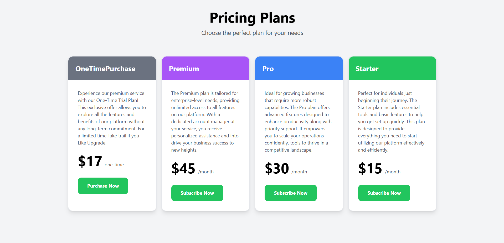
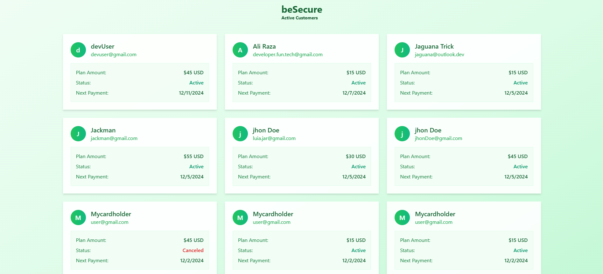

# Stripe-OneTimePayment-Subcription-Integration-with-JWT-ExpressJs-Node-MongoDb

# Landing-Page

# Registing User in mongoDb 

# LogingIn User in mongoDb 

# One Time Purchase & Subcriptions Plans

# Payment Session from strip for Subcriptions

# Payment Session Success

# Admin Access Route- Get all customers with active plans

# Payment Session Cencel

